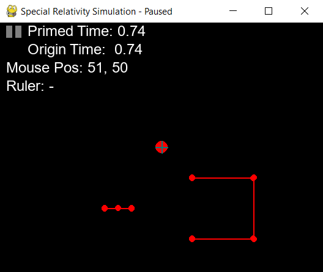

# Special Relativity Simulator

This project contains a simulator built around the principles of special 
relativity.  Additonally, an interactive viewer allows the user to explore the 
affects of special relativity in action.

This project was written for Advanced Computational Physics at 
the Rochester Institute of Technology in May of 2021.

A complete report describing the goals, design, and issues of this project is found 
within `Final Report.pdf`.

---

# Example Simulations

The primary simulation code is contained within `SpecialRelativity.py`.  Additionally, 
several example simulations can be found in `Example Simulations.py`.  These 
simulations include:

* Random particles: A set of particles randomly dispersed throughout the scene.  
  This simulation demonstrates how different particles view the system based on 
  their relative velocity.
* Moving polygon: A square moving at a constant speed away from the origin.  This 
  simulation demonstrates length contraction as viewed from the origin.
* Barn and ladder: A recreation of the barn and ladder paradox.  This simulation 
  recreates a textbook example often used to demonstrate special relatively in physics classes.
* Constant force test: A test where several particles move towards the right, one of 
  which is accelerating.  This was _intended_ to test accelerated reference frames.  
  However, for reasons described in `Final Report.pdf`, accelerated reference frames 
  are shown completely incorrectly.
* Electrostatic force test: A test of electrostatic force where the forces propagate 
  at the speed of light.  As a result, particles in the simulation initially remain 
  motionless, until the forces have had enough time to reach them.  Since this 
  simulation is relatively slow, the example code will load pre-computed results from 
  `Electrostatic Simulation.gz`.
* Moving line of charge: A moving line of charge is placed next to charged particle.  
  This simulation demonstrates the relationship between electricity and magnetism.  
  In one reference frame, the force appears electrostatic due to a net positive 
  charge.  In another frame, the force appears to be magnetic due to a current of 
  moving charges.  This is despite the simulation code only calculating an 
  electrostatic force.  Since this simulation is relatively slow, the example code 
  will load pre-computed results from `Line of Charge Simulation.gz`.

---

# Controls

The simulator is built around an interactive viewer that shows the results of a 
simulation.  The controls for it are as follows:

| Name               | Action                                                                        |
| ------------------ | ----------------------------------------------------------------------------- |
| Left-Click         | Enters the reference frame of the target particle or vertex                   |
| Escape             | Exits the current reference frame and returns to the origin's reference frame |
| Space              | Pauses/resumes the simulation playback                                        |
| Right-Click + Drag | Activates the ruler tool, represented with a blue line                        |

---

# Requirements

The following requirements are needed in order to run the program:

| Name       | Version                                            |
| ---------- | -------------------------------------------------- |
| Python     |  >3.8                                              |
| Pygame     |  Originally written with 1.9.6, others likely work |
| Numpy      |  Any                                               |
| Matplotlib |  Any                                               |
| Pandas     |  Any                                               |
